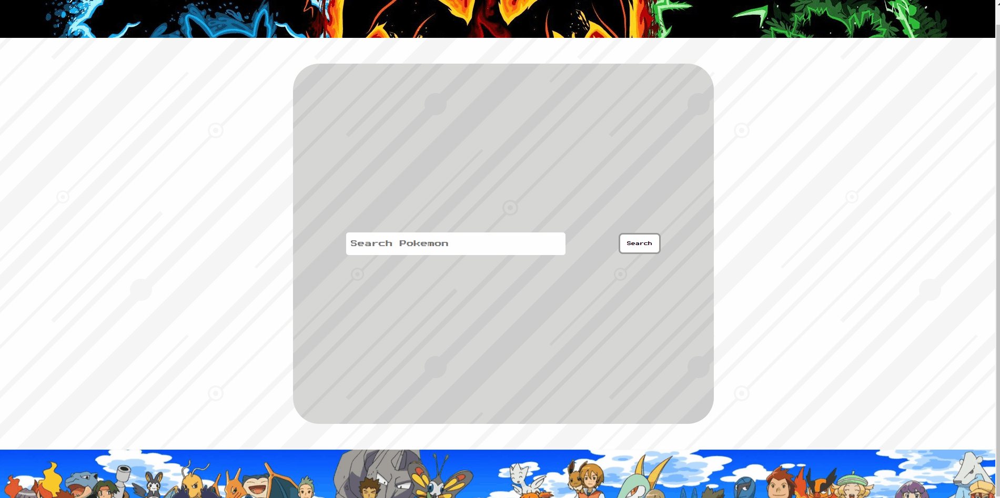

# POKEDEX

### FEEL FREE TO CHECK IT OUT : [POKEDEX](http://34.91.197.177:8080/)

### TECH USED 
    1. REACT
    2. GOOGLE CLOUD 
    3. AXIOS

### SETUP 
    1. Clone this repository on your computer and open it.
    2. Run `npm install` to install all required dependencies.
    3. Start the app with `npm start`.
        *Default: Running on PORT 3000.
    4. Go to http://localhost:3000/.

### ENJOY !